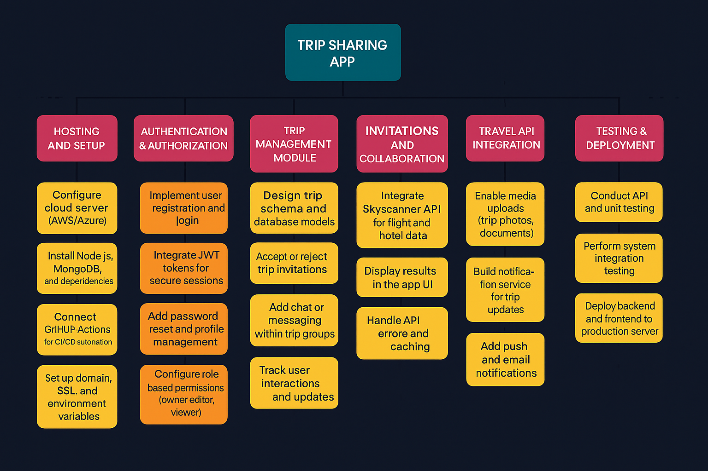
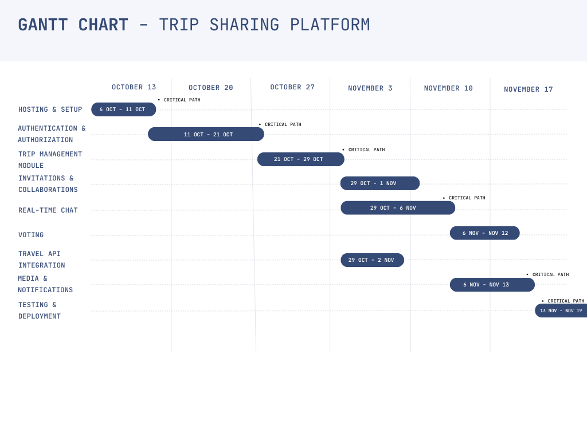
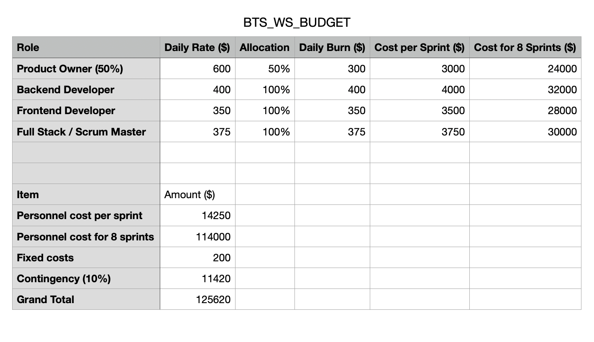
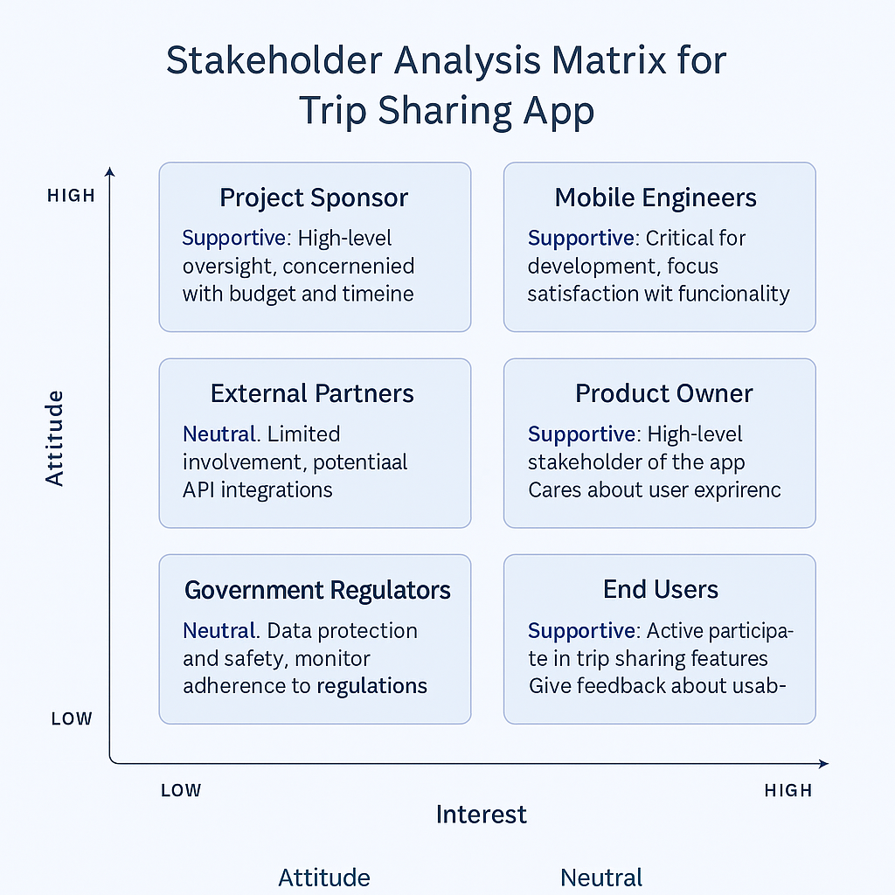
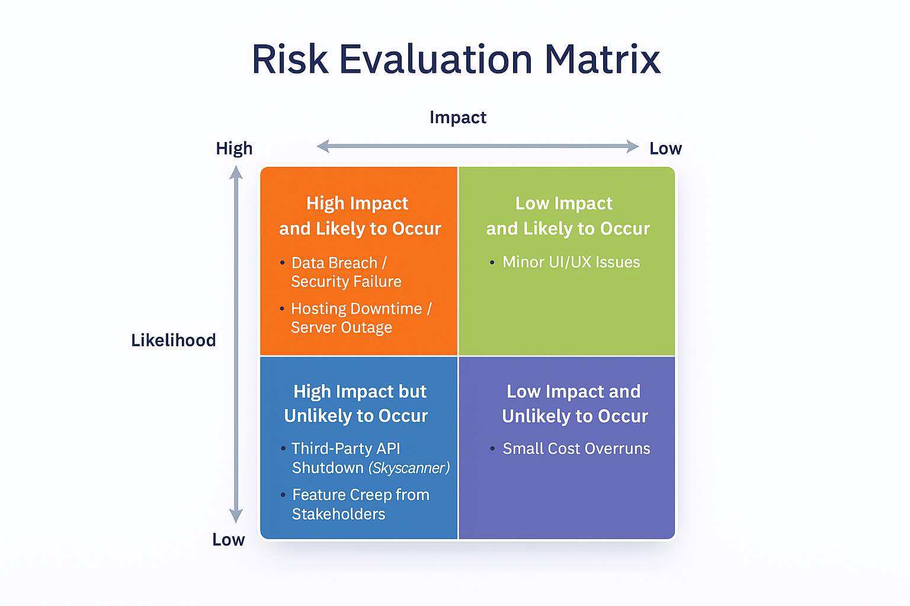

# Trip Sharing App

## 1. Introduction

This project aims to create a **Trip Sharing Mobile App** that helps groups plan trips together in a single place. Instead of juggling chats, spreadsheets, and screenshots, users will be able to create or join a trip, invite friends, discuss in real time, propose activities, vote on options, and build a shared itinerary that everyone can see.

*October 9th, 2025*  
*Current Version: 1.0*  
*Project Manager (and sponsor): Kanwar Singh Sandhu, Shashank Nanda, Krish Jitesh Gohil*

## 2. Overview

The Trip Sharing App will provide a centralized, mobile-first experience for collaborative trip planning. Users will manage trips, members, activities, and decisions in one app, with secure authentication and reliable data storage.

### 2.1 Objective

Have a production-ready mobile application that allows a group to (a) sign up / log in, (b) create or join a trip, (c) chat and propose activities, (d) vote to decide, and (e) maintain a shared itinerary—with data persisted securely and available across sessions.

## 3. Milestones

The following milestones correspond directly to the team’s sprint structure on GitHub, representing the logical progression of development phases for the Trip Sharing App:

Sprint 1 — Authentication & First Trip

Set up the user authentication system, including sign-up, login, logout, and password reset. Implement JWT or Firebase Authentication for secure credential management. Once authenticated, users can create or join their first trip, establishing the foundation for personalized trip data.

Sprint 2 — Invitations & Roles

Introduce trip collaboration features. Users can invite others via email or shareable code. Define role-based permissions such as Owner (full control), Editor (can modify trip data), and Viewer (read-only). This sprint ensures structured collaboration among users.

Sprint 3 — Itinerary (List & Calendar View)

Develop the itinerary management module to let users add, update, and delete trip activities. Activities will be displayed in list format for quick edits and calendar view for visual organization. This phase enhances trip planning clarity.

Sprint 4 — Real-time Chat

Implement an in-app messaging system using technologies like Firebase Realtime Database or WebSockets. Each trip will have its own chat room for discussions, enabling members to coordinate instantly without switching platforms.

Sprint 5 — Voting System

Add a voting mechanism where members can create polls (e.g., choosing destinations or travel dates). Votes will be displayed transparently with real-time result updates, supporting democratic decision-making within groups.

Sprint 6 — Travel Integration (Skyscanner API)

Integrate third-party travel APIs, such as Skyscanner, to allow users to search for flights and accommodations directly in the app. This streamlines trip planning by connecting decision-making with real-world travel options.

Sprint 7 — Media & Notifications

Add a photo-sharing module for users to upload pictures related to their trips. Implement push notifications for updates like new messages, itinerary edits, or votes. This enhances engagement and keeps everyone informed.

Sprint 8 — CI/CD, Docker & Final Polish

Focus on deployment readiness and optimization. Containerize the app using Docker and implement CI/CD pipelines via GitHub Actions for automated testing and delivery. Perform bug fixes, UI refinements, and performance tuning before release.

### 3.1 Work Breakdown Structure

### 3.2 Requirements Traceability Matrix

| Req ID | Requirement | Del ID | Deliverable | Owner | Status |
|--------|--------------|--------|------------|--------|---------|
| REQ01 | Secure user authentication and authorization | DEL01 | Authentication Module | Team | Completed |
| REQ02 | Trip creation, management, and deletion through API | DEL02 | Trip Management System | Team | In Progress |
| REQ03 | Invitation system with accept/reject functionality | DEL03 | Invitation & Collaboration Feature | Team | Planned |
| REQ04 | Flight and accommodation data fetched from external API | DEL04 | Travel API Integration | Team | Planned |
| REQ05 | Real-time updates and notifications | DEL05 | Media & Notification System | Team | Planned |
| REQ06 | Automated testing and CI/CD deployment | DEL06 | Testing & Deployment Pipeline | Team | Planned |
| REQ07 | App must allow users to upload media to trips | DEL05 | Media & Notification System | Team | Planned |
| REQ08 | App must present itinerary updates in real time | DEL05 | Media & Notification System | Team | Planned |
| REQ09 | App must handle API errors gracefully with fallback UI | DEL06 | API Integration Layer | Team | Planned |
| REQ10 | App must support responsive UI for both web and mobile screens | DEL07 | Responsive Frontend Interface | Team | Planned |
| REQ11 | All trip and user data must persist in a secure database | DEL08 | Database Schema & Persistence Layer | Team | Planned |

# 4. Deliverables

The Trip Sharing App project will produce several key deliverables that ensure the functionality, usability, and maintainability of the system. Each deliverable represents a major outcome of development, testing, or integration work completed during specific sprints.

| # | Deliverable | Description |
|---|--------------|-------------|
| 1 | **Authentication Module** | Implements secure user sign-up, login, logout, and password reset functionality using modern authentication standards (e.g., JWT or Firebase Auth). Includes email verification and encrypted credential storage. |
| 2 | **Trip Management Module** | Enables users to create, join, and manage trips. Supports trip ownership roles (owner, editor, viewer), invitation management, and basic trip metadata (title, dates, description). |
| 3 | **Itinerary Module** | Provides functionality to create, edit, and organize trip activities. Displays data both in a chronological list view and calendar view to help groups visualize their plans. |
| 4 | **Collaboration Tools** | Adds real-time chat and group messaging within each trip, allowing participants to discuss plans and updates. Also includes push notifications for activity changes and important updates. |
| 5 | **Voting Feature** | Allows group members to propose and vote on trip decisions such as destination, travel dates, or activities. Displays results transparently to promote consensus-based planning. |
| 6 | **API Integration Layer** | Integrates with third-party travel APIs (e.g., Skyscanner) for flight and accommodation search, and supports media upload functionality for photos and shared trip galleries. |
| 7 | **Automation & Deployment Pipeline** | Includes a Dockerized environment for consistent builds, along with CI/CD workflows (e.g., GitHub Actions) to automate testing, deployment, and delivery to hosting platforms. |
| 8 | **Documentation Package** | Provides detailed user documentation, developer setup instructions, and API references. Ensures maintainability and scalability for future iterations of the app. |
| 9 | **Testing Suite** | Includes automated unit, integration, and UI tests to validate app stability, data integrity, and user experience across devices. |

---

### 4.1 Gantt Chart  

## 5. Preliminary Budget  

## 6. Organization and Stakeholders  
   

### 6.1 Communication Plan
### Communications Plan

| Communication Item | Stakeholder | Purpose | Frequency | Format | Responsible |
|--------------------|-------------|----------|-----------|---------|-------------|
| Sprint Progress Updates | Project Sponsor | Keep sponsor informed on budget, timeline, and risks | Weekly | Email + Sprint Report | Project Manager |
| Development Sync & Issue Tracking | Mobile Engineers | Discuss technical blockers, assign tasks, align on development | Twice per week | Slack + GitHub Issues | Tech Lead |
| API Integration Review | External Partners | Review feasibility, API limits, and integration changes | As needed / milestone-based | Email + API Documentation | API Integration Lead |
| Feature Prioritization Meeting | Product Owner | Validate requirements, prioritize features, ensure alignment with user needs | Weekly | Zoom Meeting + Product Board | Product Manager |
| User Feedback Collection | End Users | Gather usability feedback, test trip-sharing features | At prototype & major releases | Surveys + In-App Feedback | UX Researcher |
| Compliance & Data Protection Check | Government Regulators | Ensure adherence to privacy laws and data security standards | At key deliverables | Compliance Report | Compliance Officer |
| Design Review & UX Alignment | UI/UX Designers | Ensure visual consistency, validate user flows, and approve interface changes before development | Bi-weekly or per major feature | Figma Review + Zoom Meeting | Project Manager |

## 7. Risks, Assumptions, and Constraints  

**7.1 Identified Risks**

1. Security & Data Breach Risk (High Impact, High Likelihood)
Sensitive user information—including trip details, chat messages, and profile data—may be exposed due to weak authentication, misconfigured API endpoints, or insecure cloud storage. A breach could compromise user trust and require urgent remediation.

2. Third-Party API Instability (High Impact, Low Likelihood)
External services such as Skyscanner or other travel APIs may experience outages, rate-limiting, or return inconsistent data. This can disrupt the core functionality of flight and hotel search features.

3. Development Delays from Technical Complexity (High Impact, High Likelihood)
Challenges in implementing real-time chat, collaborative editing, or CI/CD pipelines may extend sprint timelines. Team workload imbalance or unresolved bugs could slow development progress.

4. Low User Adoption & Engagement (High Impact, Low Likelihood)
If the interface lacks clarity or does not provide enough perceived value, users may not engage with collaboration features such as shared itineraries or group voting. This could reduce the overall success of the platform.

5. Media Storage Overload (Low Impact, High Likelihood)
Heavy use of photo and media uploads could exceed expected storage limits, increasing operational costs or requiring additional storage optimization strategies.

6. Compliance & Privacy Regulation Risk (High Impact, Low Likelihood)
Misalignment with data protection standards (GDPR, PIPEDA, etc.) may require architectural changes or lead to legal consequences. Proper data handling and retention policies must be enforced to avoid compliance issues.

### 7.2 Matrix of Risks

### 7.2 Assumptions
- All team members have basic familiarity with mobile development tools and GitHub workflow.
- External APIs (e.g., Skyscanner) will remain available, stable, and within free-tier limits during   
  development.
- Users will have stable internet access while using the app.
- Mobile devices used for testing will support modern frameworks and required OS versions.
- Cloud hosting services (e.g., Firebase, AWS) will remain operational with minimal downtime.
- Sprint schedule and team availability will remain consistent throughout the project timeline.

### 7.3 Quality Assurance
- Automated unit tests will be implemented for authentication, trip management, and API integration modules.
- Integration testing will verify that chat, voting, media upload, and itinerary features work correctly together.
- Code reviews will be conducted for all pull requests to ensure code quality and maintainability.
- Continuous Integration (CI) via GitHub Actions will automatically run tests on each commit.
- UI/UX walkthroughs and user testing sessions will be conducted to validate usability and performance.
- Error handling and fallback mechanisms will be tested for API failures and network disruptions.
